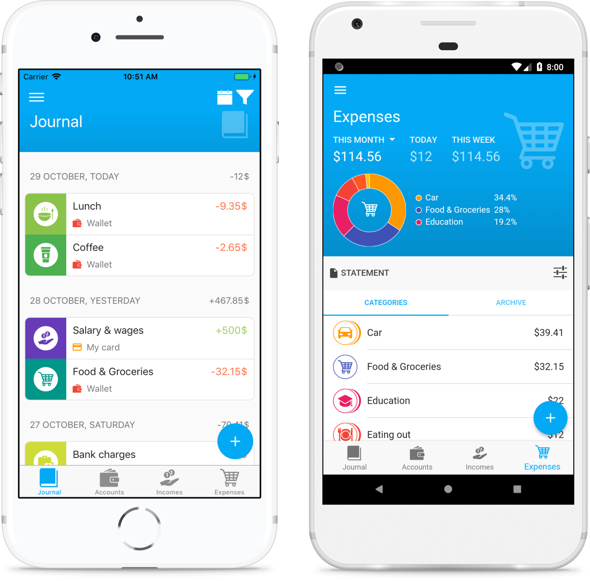

# Monento

Cross-platform application for personal finance tracking

**[Download apps](#download)**

## Features

- 🚀 Easy to start
- 📱 Apps for Android, iOS, Mac, Windows and Linux
- ☁️ Cloud syncing between devices with end-to-end encryption
- 💵 Multi-currency accounts: 150 currencies are available
- 🛒 Custom categories: you can create an own structure of accounts, incomes and expenses
- 🔖 Tags: transactions can be marked by tags to overview specific cases
- 🔐 Local encryption
- 📦 Import and export data by CSV and JSON files

## Screenshots

### Phone

### Tablet

## Pricing Plans

**Basic** plan is free:
- Accounting
- Categories and tags
- Local encryption
- Data import and export

**Monento Pro** plan costs $1/month or $10/year:
- Cloud data syncing
- All basic features
- 14-day free trial

The **Monento Pro** subscription can be purchased via Android, iOS and Mac apps. The subscription will be linked with your user account and will work on other Monento app.

_Final price and currency may vary by an app store and location. The final price is displayed by the store before completing a payment._

## Download

**Android**

- [Download on Google Play][google-play-store]
- [Download APK file][download-android-apk]

**iOS**

- [Download on the App Store][apple-app-store]

**macOS**

- [Download on the Mac App Store][apple-mac-store]
- [Download DMG file][download-mac-dmg]

**Windows**

- [App installer (64-bit)][download-win-x64]
- [App installer (32-bit)][download-win-ia32]

**Linux**

- [Download from the Snap Store](https://snapcraft.io/monento)
- [AppImage (64-bit)][download-linux-appimage]
- [tar.gz (64-bit)][download-linux-targz]
 
More builds are at the [release page][latest-release].

## Documentation

- Data formats
  - [Format of CSV files](docs/csv-files.md)

## Contacts

Email: [support@monento.com](mailto:support@monento.com)

---
© 2018-2022 [Mikhail Nasyrov][mnasyrov-github] • [Terms of Service](terms.md) • [Privacy Policy](privacy.md)

[mnasyrov-github]: https://github.com/mnasyrov
[apple-app-store]: https://itunes.apple.com/app/id1358591666
[apple-mac-store]: https://itunes.apple.com/app/id1425801329
[google-play-store]: https://play.google.com/store/apps/details?id=com.monento.app
[latest-release]: https://github.com/mnasyrov/monento/releases/latest
[download-android-apk]: https://github.com/mnasyrov/monento/releases/download/v1.2.8/Monento-1.2.8-android.apk
[download-mac-dmg]: https://github.com/mnasyrov/monento/releases/download/v1.2.8/Monento-1.2.8-mac.dmg
[download-win-x64]: https://github.com/mnasyrov/monento/releases/download/v1.2.8/Monento-1.2.8-win-x64.exe
[download-win-ia32]: https://github.com/mnasyrov/monento/releases/download/v1.2.8/Monento-1.2.8-win-ia32.exe
[download-linux-appimage]: https://github.com/mnasyrov/monento/releases/download/v1.2.8/Monento-1.2.8-linux-x86_64.AppImage
[download-linux-targz]: https://github.com/mnasyrov/monento/releases/download/v1.2.8/Monento-1.2.8-linux-x64.tar.gz
